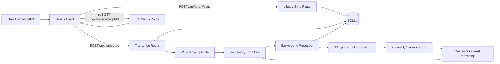

# Shiur Reader App

Shiur Reader is a Next.js web app that turns the first few minutes of a long audio recording into readable text, so users can quickly understand the beginning of a shiur without listening end-to-end.

The app currently supports MP3 input, splits the selected preview window into 1-minute chunks, transcribes each chunk with AssemblyAI, and then lightly formats the transcript with Gemini (default) or OpenAI for readability.

## Purpose

- Save time when triaging long recordings.
- Provide a readable preview of the opening section (3, 5, or 10 minutes).
- Keep processing transparent with chunk-level progress and per-chunk results.

## Core Features

- Select an MP3 folder from the browser (persistent on supported browsers).
- Automatic folder restore on next app open (Android Chrome / PWA).
- Server-saved shared library list that can be reopened on another paired device.
- QR-based anonymous device pairing for sharing one library between desktop and phone.
- Manual Refresh action to re-scan folder contents after updates.
- Select preview length: 3, 5, or 10 minutes.
- Incremental preview generation (reuses existing minutes and generates only missing minutes).
- Background server job with polling-based progress updates.
- Chunk-by-chunk transcript rendering with status indicators.
- Basic PWA installability (manifest + service worker registration).

## Tech Stack

- Framework: Next.js 16 (App Router)
- UI: React 19 + Tailwind CSS 4
- Language: TypeScript
- Speech-to-text: AssemblyAI SDK
- Transcript cleanup/formatting: Gemini via @google/genai (default) or OpenAI via openai SDK
- Audio chunk extraction: FFmpeg CLI (invoked from Node)
- Job IDs: uuid

## How It Works

1. User selects an MP3 folder and picks a preview length.
2. Browser syncs MP3 metadata with POST /api/library/sync.
3. User picks one MP3 from the synced list and starts preview.
4. Browser sends multipart form data to POST /api/transcribe.
5. Server checks SQLite cache first:
	 - Full hit: returns saved preview immediately.
	 - Partial hit: generates only missing minutes (for example 3->5 means only minutes 4-5).
	 - Miss: generates all requested minutes.
6. New minute chunks are persisted in SQLite as they complete.
7. A background task processes each 60-second chunk:
	 - Extract chunk with FFmpeg
	 - Transcribe chunk with AssemblyAI
	 - Format transcript text with Gemini (default) or OpenAI
8. Browser polls GET /api/transcribe/:jobId every 2 seconds.
9. UI shows progress and chunk outputs as they complete.



## API Endpoints

### POST /api/transcribe

Starts a new transcription preview job.

Behavior:

- Cache hit: returns a completed job backed by stored chunks.
- Partial cache hit: starts job from the first missing minute.
- Cache miss: starts full generation.

Request:

- Content-Type: multipart/form-data
- Fields:
	- file: audio file (currently stored as input.mp3 on server temp path)
	- previewLength: one of 3, 5, 10 (minutes)

Success response:

```json
{
	"jobId": "uuid-string"
}
```

Error response example:

```json
{
	"error": "Preview length must be one of: 3, 5, 10 minutes"
}
```

### GET /api/transcribe/:jobId

Returns job status and chunk results.

Response shape:

```json
{
	"status": "pending | processing | done | error",
	"completedChunks": 2,
	"totalChunks": 5,
	"currentChunk": 3,
	"chunks": [
		{
			"index": 1,
			"status": "done",
			"text": "..."
		},
		{
			"index": 2,
			"status": "error",
			"error": "..."
		}
	],
	"error": "optional job-level error"
}
```

### POST /api/library/sync

Registers/syncs current folder MP3 metadata and returns preview availability for the selected preview length.

Request JSON:

```json
{
	"previewLength": 5,
	"files": [
		{
			"name": "shiur.mp3",
			"relativePath": "MyShiurFolder/shiur.mp3",
			"size": 123456,
			"lastModified": 1750000000000
		}
	]
}
```

### GET /api/library

Returns the current owner-scoped saved library and active source metadata for the selected preview length.

Query params:

- `previewLength`: one of `3`, `5`, `10`

### POST /api/pair/start

Creates a short-lived pairing session for the current anonymous owner and returns a QR-friendly pairing URL.

### POST /api/pair/complete

Consumes a pairing token and binds the current device to the same anonymous owner as the device that created the QR code.

## Project Structure

```text
app/
	api/library/route.ts               # GET endpoint: load shared saved library
	api/transcribe/route.ts            # POST endpoint: create + start job
	api/transcribe/[jobId]/route.ts    # GET endpoint: poll job state
	api/pair/start/route.ts            # POST endpoint: start QR pairing
	api/pair/complete/route.ts         # POST endpoint: consume QR pairing token
	page.tsx                           # Main client UI and polling logic
components/
	AudioSelector.tsx                     # Folder select + refresh controls
	PreviewLengthSelector.tsx
	GenerateButton.tsx
	ProgressIndicator.tsx
	TranscriptViewer.tsx
	ServiceWorkerRegistration.tsx
lib/services/
	previewStore.ts                       # SQLite cache/index store
	transcriptionJob.ts                # Job state model + background loop
	ffmpeg.ts                          # FFmpeg wrapper
	assembly.ts                        # AssemblyAI integration
	openai.ts                          # Transcript formatting provider (Gemini/OpenAI)
lib/server/
	ownerSession.ts                    # Anonymous owner cookie helper
app/api/library/sync/route.ts          # Folder library sync endpoint
public/
	manifest.json
	sw.js
```

## Prerequisites

- Node.js 20+
- npm
- FFmpeg available on PATH
- AssemblyAI API key
- Gemini API key (default formatter)
- OpenAI API key (optional, for OpenAI formatter)

Install FFmpeg on Ubuntu/Debian:

```bash
sudo apt update
sudo apt install -y ffmpeg
```

## Setup

1. Install dependencies:

```bash
npm install
```

2. Create local environment file:

```bash
cp .env.local.example .env.local
```

3. Set environment variables in .env.local:

```env
ASSEMBLYAI_API_KEY=your_assemblyai_api_key_here
OPENAI_API_KEY=your_openai_api_key_here
GEMINI_API_KEY=your_gemini_api_key_here
TRANSCRIPT_AI_PROVIDER=gemini
```

## Run

Development:

```bash
npm run dev
```

Production build:

```bash
npm run build
npm run start
```

Lint:

```bash
npm run lint
```

## Usage

1. Open the app in the browser.
2. Upload an MP3 file.
3. Select preview length (3/5/10 minutes).
4. Click Generate Preview.
5. Watch progress as chunks are processed.
6. Read completed chunk transcripts as they appear.

## Environment Variables

- ASSEMBLYAI_API_KEY: required, used in lib/services/assembly.ts
- GEMINI_API_KEY: required by default, used when TRANSCRIPT_AI_PROVIDER=gemini
- OPENAI_API_KEY: required only when TRANSCRIPT_AI_PROVIDER=openai
- TRANSCRIPT_AI_PROVIDER: optional, gemini (default) or openai
- GEMINI_MODEL: optional, defaults to gemini-3.1-flash-lite
- TRANSCRIPT_AI_DEBUG: optional, set true to print transcript formatter request/error debug logs on server

## Operational Notes

- Jobs are in memory while running, but generated minute chunks are persisted in SQLite.
- After server restart, saved preview chunks remain available from SQLite cache.
- Temporary files are created under OS temp dir and removed after processing.
- Chunk failures do not stop the whole job; processing continues for later chunks.
- A job can still finish with status done even if some chunks have status error.

## Current Limitations

- Single-instance MVP design (no persistent queue or shared datastore).
- No user authentication or rate limiting.
- No true offline behavior despite service worker presence.
- Assumes FFmpeg is installed and callable as ffmpeg.
- Default models can be overridden via GEMINI_MODEL and OPENAI_MODEL.

## Troubleshooting

- Error: ffmpeg not found
	- Install FFmpeg and ensure it is in PATH.
- Error: No audio file provided
	- Ensure form field name is file.
- Error: Preview length must be one of 3, 5, 10
	- Send a valid previewLength.
	- Error from AssemblyAI/Gemini/OpenAI
	- Check API keys and account quotas.

## Security and Privacy Considerations

- Uploaded audio is processed server-side and sent to third-party APIs (AssemblyAI and Gemini/OpenAI).
- Do not upload sensitive audio unless your policy allows external processing.
- Consider adding consent messaging and retention policy documentation before production usage.

## Future Improvements

- Persistent job storage (Redis/DB) and resumable job tracking.
- Queue/worker architecture for scaling.
- Support more audio formats and configurable chunk length.
- Better retry behavior for per-chunk failures.
- Optional raw transcript view alongside formatted output.
